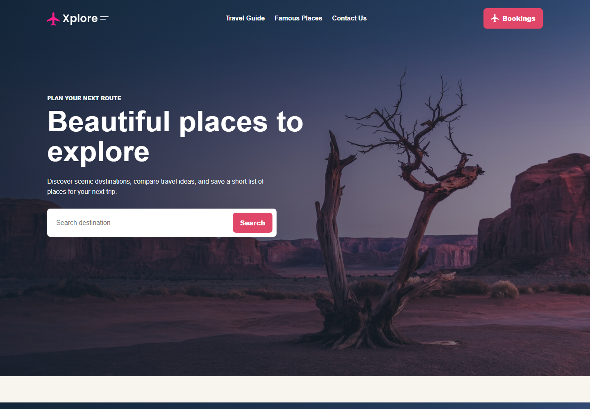

# Xplore Travel



A responsive travel landing page with featured destinations, a guide section, search filtering, and a booking request form.

## Live Demo

https://rajesh-d-kasar.github.io/xplore/

## Highlights

- Full-screen travel hero using the existing background image.
- Destination cards with JavaScript search filtering.
- Booking/contact form with instant confirmation text.
- Responsive layout for mobile and desktop.

## Run Locally

Open `index.html` in a browser.

## Deploy

This project is deployed with GitHub Pages from the `main` branch root.

## Files

```text
xplore/
|-- index.html
|-- style.css
|-- script.js
|-- assets/
|   `-- screenshot.png
|-- README.md
`-- image assets
```
